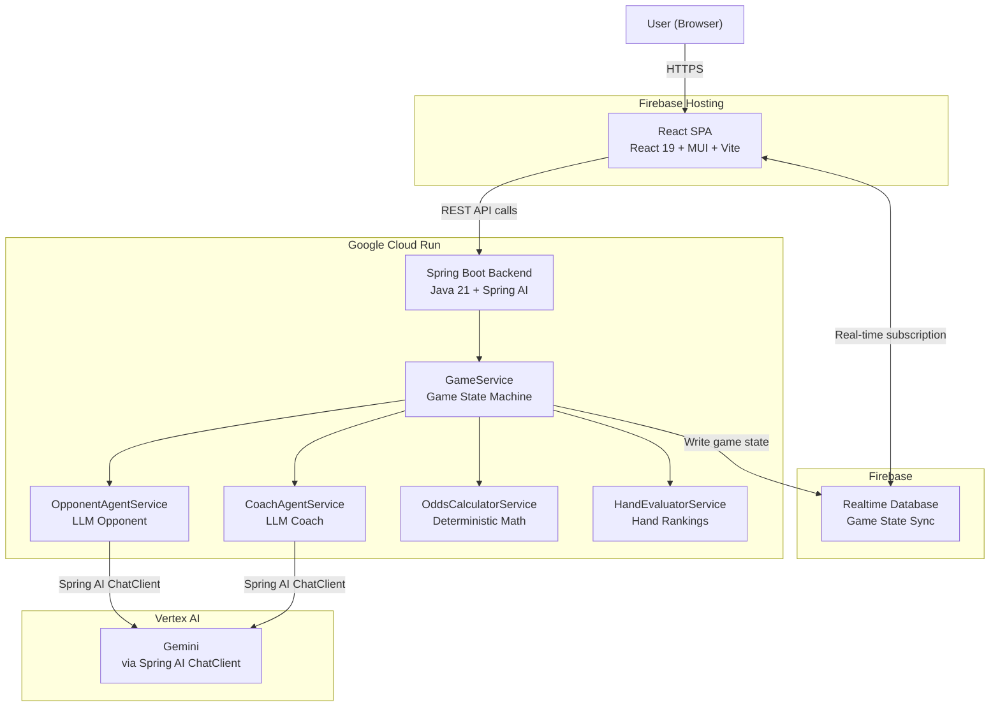
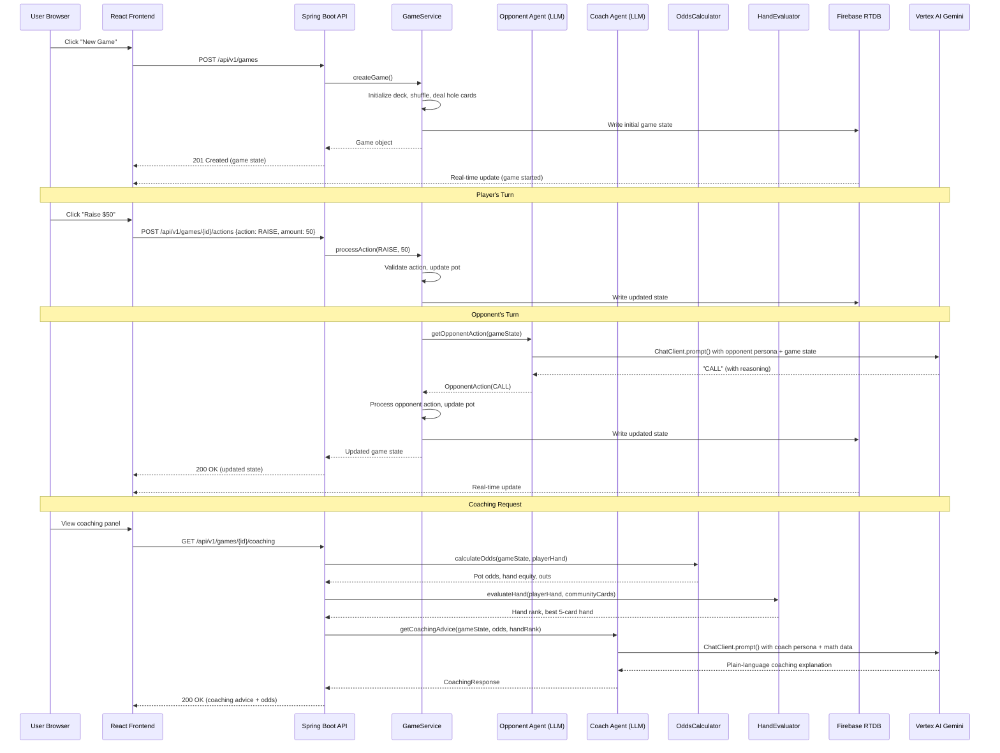

# Architecture -- "The Nut" Poker Tutor

## High-Level Service Architecture



## Multi-Agent Flow



## Tech Stack

| Service | Technology | Version | Rationale |
|---------|-----------|---------|-----------|
| **Backend API** | Spring Boot | 3.4+ | Enterprise-grade Java framework with dependency injection, profiles, and extensive Spring AI integration |
| **AI Framework** | Spring AI | 1.0+ | First-class Spring integration for LLM orchestration; ChatClient with advisor chains for multi-agent patterns |
| **Runtime** | Java | 21 | LTS release with modern language features (records, pattern matching, virtual threads) |
| **Build Tool** | Gradle | 8.x | Flexible build system with Jib plugin for containerization without Dockerfile |
| **LLM Model** | Vertex AI Gemini | via Spring AI | Google's flagship model accessible through Spring AI's ChatClient abstraction |
| **Frontend** | React | 19.x | Latest stable; component model ideal for complex interactive UI (poker table, cards, panels) |
| **UI Library** | Material UI (MUI) | 6.x | Comprehensive component library with dark theme support; pre-built components for cards, dialogs, buttons |
| **Frontend Tooling** | Vite | 6.x | Fast dev server with HMR; optimized production builds |
| **Frontend Hosting** | Firebase Hosting | N/A | CDN-backed static hosting with custom domain support |
| **Real-Time Database** | Firebase RTDB | N/A | Low-latency real-time data sync; ideal for game state that changes frequently and needs instant UI updates |
| **Container Runtime** | Cloud Run | N/A | Serverless containers with automatic scaling; native IAM for Vertex AI and Firebase access |
| **Containerization** | Jib (Gradle plugin) | N/A | Builds OCI containers without a Dockerfile; base image `eclipse-temurin:21-jre` |

## Key Design Decisions

### 1. Multi-Agent Orchestration with Spring AI

**Decision:** Use two separate Spring AI ChatClient instances with distinct system prompts rather than a single general-purpose agent.

**Rationale:** The Opponent Agent and Coach Agent have fundamentally different goals. The Opponent needs to play poker convincingly (bluff, vary play style, show personality). The Coach needs to provide accurate mathematical analysis with clear explanations. Combining these into one agent would create conflicting objectives in the prompt. Separate ChatClient instances allow independent prompt engineering, temperature settings, and response parsing for each role.

**Implementation:**
- `OpponentAgentService` uses a ChatClient configured with the opponent persona prompt, higher temperature (0.8) for creative/unpredictable play, and structured output for action selection.
- `CoachAgentService` uses a ChatClient configured with the coach persona prompt, lower temperature (0.3) for consistent analytical output, and receives pre-calculated mathematical data as context.
- Both agents receive the same game state but different system instructions.

### 2. Deterministic Math Separated from LLM Reasoning

**Decision:** Calculate pot odds, hand equity, outs, and hand rankings in pure Java services. The LLM is only used for opponent decision-making and coaching explanations.

**Rationale:** LLMs are unreliable for exact mathematical calculations. Pot odds and combinatorics have deterministic correct answers. By computing these in Java (`OddsCalculatorService`, `HandEvaluatorService`) and passing the results to the Coach Agent as context, we ensure mathematical accuracy while leveraging the LLM for its strength: generating clear, contextual explanations of *why* the math matters for this specific hand.

**Implementation:**
- `HandEvaluatorService` implements standard poker hand ranking (Royal Flush through High Card) using a 5-card combination evaluator.
- `OddsCalculatorService` calculates pot odds (bet-to-call / total-pot), counts outs, and estimates hand equity using Monte Carlo simulation or combinatorial enumeration.
- The Coach Agent prompt includes a section: "Here are the exact calculations for this hand: [pot odds], [equity], [outs]. Explain to the player what these numbers mean and what action they recommend."

### 3. Game State Machine

**Decision:** Model Texas Hold'em as an explicit state machine with phases (PRE_FLOP, FLOP, TURN, RIVER, SHOWDOWN) and enforced transitions.

**Rationale:** Texas Hold'em has strict rules about when actions are valid, when community cards are dealt, and when the hand is complete. An explicit state machine prevents invalid game states (e.g., betting after showdown, dealing the turn before the flop betting round completes). Each phase defines: valid actions, transition conditions, and side effects (dealing cards, moving chips).

**Implementation:**
- `GamePhase` enum: PRE_FLOP, FLOP, TURN, RIVER, SHOWDOWN
- `GameService.processAction()` validates the action against the current phase and player turn, updates the game state, and transitions to the next phase when the betting round is complete.
- Phase transitions trigger: dealing community cards, resetting current bets, and (at SHOWDOWN) evaluating hands and awarding the pot.

### 4. Firebase Realtime Database for Game State Sync

**Decision:** Use Firebase RTDB rather than WebSockets or polling for real-time game state delivery to the frontend.

**Rationale:** Firebase RTDB provides built-in real-time sync with automatic reconnection, offline support, and a simple listener API. This eliminates the need to implement WebSocket server logic in Spring Boot, manage connection state, or handle reconnection. The backend writes game state to RTDB after each action; the frontend subscribes to the game path and receives updates automatically.

**Implementation:**
- Backend writes to `games/{gameId}` in Firebase RTDB using the Firebase Admin SDK after each state change.
- Frontend subscribes to `games/{gameId}` using the Firebase JS SDK `onValue()` listener.
- Game state includes a version/sequence number to detect and resolve conflicts.

### 5. Monorepo Structure

**Decision:** Keep `backend/` and `frontend/` in the same repository.

**Rationale:** This is a single project with tightly coupled API contracts. A monorepo simplifies development (one clone, one branch, atomic changes to API + UI), CI/CD (single pipeline), and documentation (shared docs/).

## Project Source Code Structure

```
poker-tutor/
  README.md
  CLAUDE.md
  AGENTS.md
  .gitignore
  docs/
    README.md
    architecture.md
    api-contracts.md
    milestones.md
    local-dev-guide.md
    local-testing-guide.md
    production-deployment.md
  backend/
    build.gradle
    settings.gradle
    src/
      main/
        java/com/jkingai/pokertutor/
          PokerTutorApplication.java         # Spring Boot main class
          config/
            VertexAiConfig.java              # Spring AI ChatClient beans for Vertex AI
            FirebaseConfig.java              # Firebase Admin SDK initialization
          controller/
            GameController.java              # Game REST endpoints
            CoachingController.java          # Coaching REST endpoints
          service/
            GameService.java                 # Game orchestration and state machine
            HandEvaluatorService.java        # Poker hand ranking and evaluation
            OddsCalculatorService.java       # Pot odds, equity, outs calculation
            OpponentAgentService.java        # LLM opponent agent (Spring AI)
            CoachAgentService.java           # LLM coaching agent (Spring AI)
          model/
            Game.java                        # Game state entity
            Card.java                        # Card with Rank + Suit enums
            Deck.java                        # Shuffleable deck of 52 cards
            Hand.java                        # Player's hand (hole cards + best 5)
            Player.java                      # Player state (chips, cards, status)
            HandRank.java                    # Hand ranking enum (Royal Flush..High Card)
            GamePhase.java                   # Game phase enum
            PlayerAction.java               # Player action enum
          dto/
            GameRequest.java                 # Create game request DTO
            GameResponse.java                # Game state response DTO
            ActionRequest.java               # Player action request DTO
            CoachingResponse.java            # Coaching advice response DTO
            OddsResponse.java                # Odds/probability response DTO
          exception/
            GameNotFoundException.java       # 404 for missing games
            InvalidActionException.java      # 400 for invalid player actions
            GlobalExceptionHandler.java      # @ControllerAdvice exception handler
        resources/
          application.yml                    # Default Spring Boot config
          application-local.yml              # Local development profile
          prompts/
            opponent_persona.txt             # Opponent agent system prompt template
            coach_persona.txt                # Coach agent system prompt template
  frontend/
    package.json
    vite.config.js
    index.html
    src/
      main.jsx                               # React entry point
      App.jsx                                # Root component with Router + ThemeProvider
      theme.js                               # MUI dark theme (poker green aesthetic)
      api/
        client.js                            # REST API client
        firebase.js                          # Firebase RTDB client
      components/
        GameTable.jsx                        # Poker table layout
        CardDisplay.jsx                      # Playing card rendering
        PlayerPanel.jsx                      # Player info (chips, name, status)
        ActionControls.jsx                   # Bet/Call/Fold/Raise buttons
        CoachingPanel.jsx                    # Coach advice display
        OddsDisplay.jsx                      # Pot odds and probability display
        HandHistory.jsx                      # Hand history list
        TopNav.jsx                           # Navigation bar
      pages/
        LobbyPage.jsx                        # Game lobby / start screen
        GamePage.jsx                         # Main game page
        HistoryPage.jsx                      # Full hand history page
      hooks/
        useGame.js                           # Game state management hook
        useGameActions.js                    # Game action dispatch hook
        useCoaching.js                       # Coaching data fetching hook
        useFirebaseSync.js                   # Firebase RTDB subscription hook
      styles/
        global.css                           # Global styles and CSS variables
```
